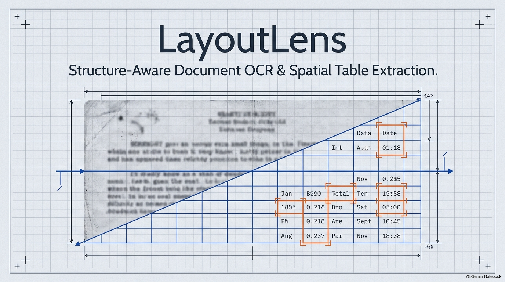
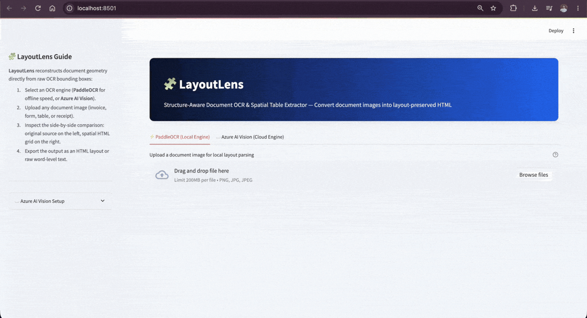

# 🧩 LayoutLens: Structure-Aware Document OCR & Table Extractor

An advanced Document AI pipeline that converts complex document images into structured HTML while perfectly preserving original page layouts, spatial elements, and tabular structures for downstream processing.

<div align="center">
  
</div>

## 📖 Overview

LayoutLens bridges the gap between raw visual documents and structured, machine-readable data. Unlike standard OCR tools that flatten text into a single continuous stream, LayoutLens acts as a spatial parser. It translates whole document images into precise HTML, maintaining the structural integrity, visual hierarchy, and physical placement of the original page.

<div align="center">
  
</div>

### Core Capabilities

* **📊 Native Table Preservation:** Accurately retains complex grid logic and spatial placement. For straightforward tables, this enables fully automated data extraction with zero manual post-processing.
* **🧠 Context-Aware Output:** By preserving the spatial layout during text extraction, the resulting HTML is perfectly formatted for RAG pipelines, NLP tasks, LLM context windows, and advanced data mining.
* **🔄 Round-Trip Reconstruction:** The structurally sound HTML acts as a precise blueprint. This allows for seamless Image ➔ Text conversion that can be rendered back to accurately replicate the original visual document.

## ⚙️ OCR Engine Architecture

LayoutLens is built with an extensible, protocol-driven architecture. You can easily switch between cloud-based and local engines, or plug in your own.

* **PaddleOCR (Default):** Runs fully locally. Fast, private, and requires no accounts or internet access.
* **Azure AI Vision (Read API):** Cloud-based OCR offering high accuracy for complex scans. Requires a free Azure account and API key. You can input credentials directly in the Streamlit UI or via a `.env` file (the UI takes priority).

**Bring Your Own Engine:** Both built-in engines satisfy the `recognizers.protocols.TextRecognizerProtocol` contract, which requires a `recognize(image_path)` method returning a `List[pd.DataFrame]` containing text and bounding boxes. Because the `html_table_builder.build_html_table` relies strictly on this protocol, you can seamlessly integrate any custom OCR engine by writing a class that matches this exact contract.

## 🚀 Installation

Ensure you are using **Python 3.11 or 3.12**.

> **Note:** Dependency wheels for `paddlepaddle` and `numpy` (as pinned in this project) are not yet officially published for Python 3.13+.

```bash
# Clone the repository
git clone [https://github.com/yourusername/layout-lens.git](https://github.com/yourusername/layout-lens.git)
cd layout-lens

# Create and activate a virtual environment
python3 -m venv .venv
source .venv/bin/activate  # On Windows use: .venv\Scripts\activate

# Install dependencies
pip install -r requirements.txt

```

*(Optional)* If using Azure AI Vision, copy the environment template and add your credentials:

```bash
cp .env.example .env

```

## 💻 Usage

Launch the interactive web interface:

```bash
streamlit run app.py

```

Once running:

1. Select your preferred OCR engine tab (PaddleOCR or Azure AI Vision).
2. Upload your document image (PNG/JPG).
3. View the rendered HTML structure, or download the raw word-level bounding box data as a CSV.

## 📂 Project Structure

```text
layout-lens/
├── app.py                          # Streamlit UI — engine
├── html_table_builder.py           # Core spatial reconstruction algorithm
├── recognizers/
│   ├── protocols.py                # OCR contract (TextRecognizerProtocol)
│   ├── paddle_recognizer.py        # Local word-level OCR implementation
│   ├── azure_recognizer.py         # Cloud word-level OCR implementation
│   └── paddleocr_models/           # PaddleOCR detection + recognition weights
├── images/                         # Documentation and UI screenshots
├── requirements.txt                # Pinned dependencies
├── .env.example                    # Template for Azure credentials
└── .gitignore

```

## 🤝 Contributions

Contributions are welcome! Please fork the repository and submit a pull request with your improvements or new features.

## 📝 License

This project is licensed under the MIT License.

---

## 💬 Connect

Stay updated and connect for any queries or contributions:

* **GitHub**: [Sudhanshu1304](https://github.com/Sudhanshu1304?utm_source=gemini)
* **LinkedIn**: [Sudhanshu Pandey](https://www.linkedin.com/in/sudhanshu-pandey-847448193/?utm_source=gemini)
* **Medium**: [@sudhanshu.dpandey](https://medium.com/@sudhanshu.dpandey?utm_source=gemini)

---

## ⭐ Support

If you find this tool useful, please consider giving it a ⭐ on GitHub. Your support is greatly appreciated!

Happy Extracting!

```

```